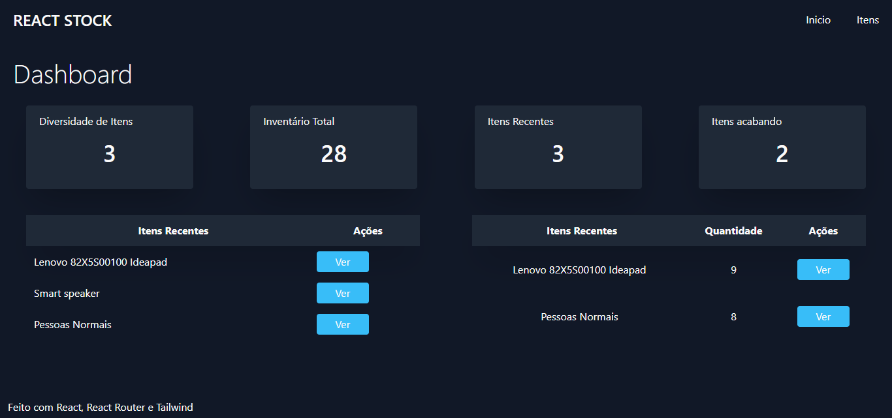
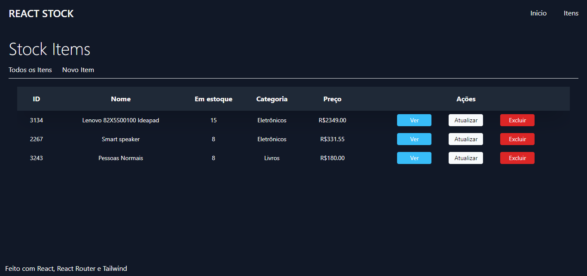
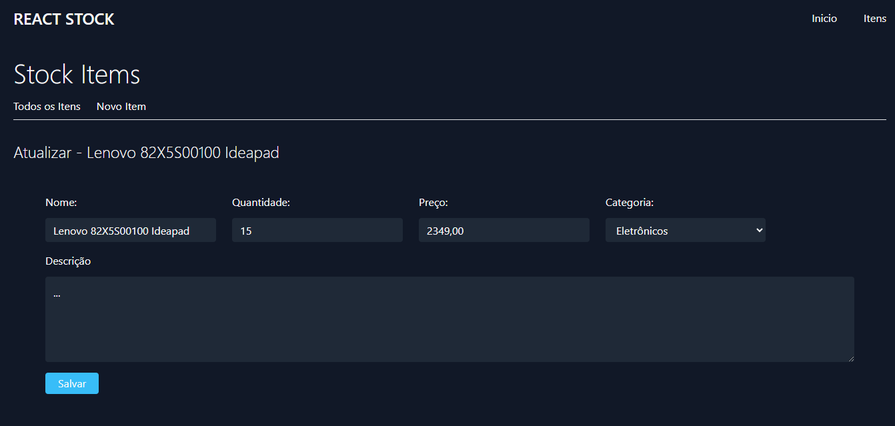
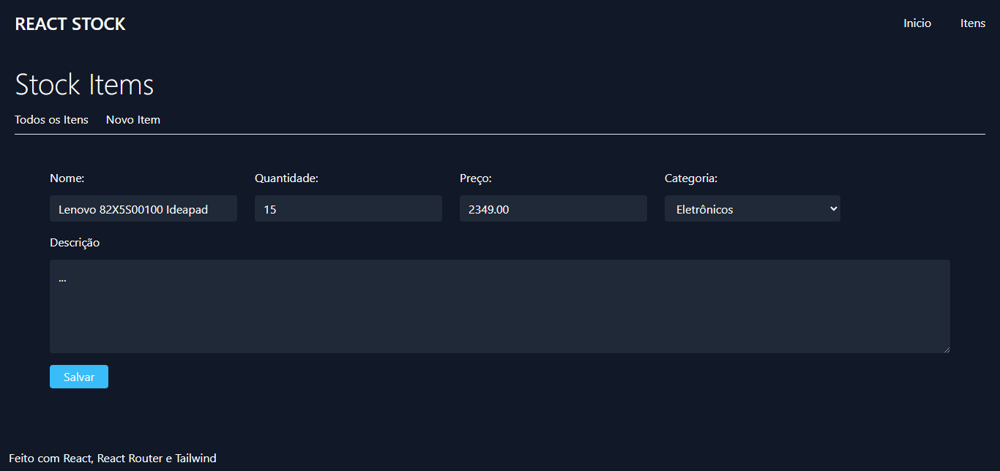
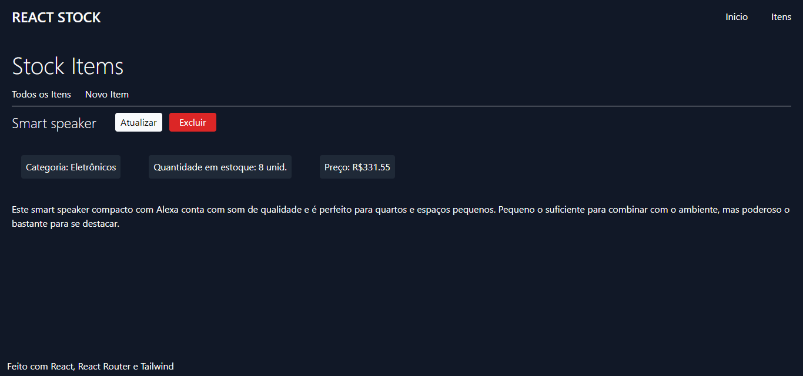

 

  # 📦 Full Stack Inventory Management System

  A full stack web project developed to assist in inventory management, allowing users to efficiently add, remove, update, and view items. Additionally, the project offers valuable insights, such as items added in the last 15 days, products with low quantity, and the diversity of items in stock.

  Built with React for the front-end and TypeScript, Node.js, Express, Prisma, and PostgreSQL for the back-end, this project provides an intuitive interface for effectively controlling inventory.

## 📷 Screenshots

### 📊 Dashboard

### 📝 Items

### ✏️ Update Item

### ➕ Create Item

### 👁️ View Item

## 🚀 Features

- **Comprehensive Inventory Management:** Add, remove, update, and view inventory items.
- **Stock Overview:** View items recently added in the last 15 days.
- **Low Stock Alerts:** Receive alerts for products that are running low.
- **Intuitive Dashboard:** Gain an overview of item diversity in the inventory.

## 🛠️ Technologies Used

### Front-end
- React: Creating dynamic user interfaces.
- Vite: Fast and efficient build tool for web projects.
- Tailwind CSS: Rapid and responsive styling.

### Back-end
- TypeScript: A statically typed superset of JavaScript.
- Node.js: A JavaScript runtime for building server-side applications.
- Express: A fast and minimalist web framework for Node.js.
- Prisma: A database toolkit for TypeScript and Node.js.
- PostgreSQL: A powerful, open-source relational database system.
- Yup: A validation library for validating data in requests.

## 🏃 How to Run the Project

1. Clone this repository.
2. Navigate to the project directory in your terminal.
3. Run `npm install` in the `stock-manager` directory to install the front-end dependencies.
4. Run `npm install` in the `backend` directory to install the back-end dependencies.
5. Configure the following environment variables in a `.env` file in the `backend` directory:
   - `DATABASE_URL`: PostgreSQL database connection URL.
   - `PORT`: Port where the back-end server will run (by default, use 3333).
6. Run `npx prisma migrate dev` to apply database migrations.
7. Run `npm run dev` in the `stock-manager` directory to start the front-end development server.
8. The front-end will be available on a port determined by Vite.

## 🤝 Contribution

Contributions are welcome! Feel free to open issues and send pull requests.

Developed with ❤️ by Diogo

